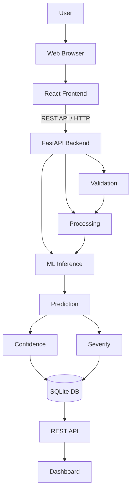

# AI-IDS Architecture

This document defines the technical architecture of the AI-IDS MVP: the first implementation slice of the larger AI-Based Network Intrusion Detection & Security Operations Platform described in [README.md](README.md) and scoped in [MVP_SCOPE.md](MVP_SCOPE.md).

This is a **design document only**. No application code, database, ML model, or dependencies have been created as part of this step.

---

## 1. System Overview

AI-IDS is a web-based system that lets a user upload network-flow data as a CSV file and receive a machine-learning-based intrusion detection assessment for that data, with a confidence score, an MVP-level severity rating, and a dashboard to review results over time.

The MVP data path:

```
User
 ↓
Web Browser
 ↓
React Frontend
 ↓
FastAPI Backend
 ↓
Data Validation
 ↓
Data Processing
 ↓
ML Inference
 ↓
Confidence
 ↓
Severity
 ↓
SQLite
 ↓
Security Dashboard
```

**Responsibility of each layer:**

| Layer | Responsibility |
|---|---|
| Web Browser | Renders the React application; the user's point of interaction. |
| React Frontend | Presents upload UI and dashboard; calls the backend REST API; renders results. |
| FastAPI Backend | Exposes the REST API; validates requests; orchestrates processing, inference, and storage. |
| Data Validation | Confirms the uploaded CSV is structurally and semantically acceptable before processing. |
| Data Processing | Cleans and transforms validated data into ML-ready features. |
| ML Inference | Loads a pre-trained model and produces predictions from processed features. |
| Confidence | Derived directly from the model's own output (e.g., predicted-class probability). |
| Severity | A transparent, rule-based mapping from prediction + confidence to a human-readable severity label. |
| SQLite | Persists detection batches, results, and model metadata. |
| Security Dashboard | Reads persisted results back through the API and presents them to the user. |

This is the first slice of the long-term platform direction (Network Data → Detection → Risk → Alerts → Correlation → Incidents → Threat Intelligence → Explainable AI → AI Security Analyst → Security Operations Dashboard). The MVP implements only Detection (with a simple confidence/severity step); everything after that in the long-term chain is out of scope for now (see [Future Extensibility](#13-future-extensibility)).

---

## 2. High-Level Architecture



**Explanation:**

- The **frontend never talks to the database or ML model directly** — it only calls the backend's REST API over HTTP.
- The **backend is the single orchestrator**: it validates input, invokes the processing layer, invokes ML inference, computes severity, and writes to SQLite — all within one FastAPI service. There is no inter-service network hop in the MVP.
- **Validation happens before processing**, and **processing happens before inference** — each stage can reject bad input early rather than letting it flow downstream.
- **Confidence** comes from the model itself; **severity** is a separate, explicit rule layer applied after prediction (not part of the trained model). Keeping these separate keeps severity transparent and auditable.
- The **dashboard reads only through the REST API**, the same as the upload flow — there is one API surface, not a separate read path.

---

## 3. Component Responsibilities

### Frontend
React + TypeScript + Tailwind CSS.

Responsibilities:
- User interface
- Navigation
- CSV upload
- Detection results
- Dashboard
- Analytics
- Model performance
- Error/loading states

### Backend
Python + FastAPI.

Responsibilities:
- REST API
- Request validation
- File handling
- Application orchestration
- ML inference coordination
- Database access
- Error handling

### Data Processing Layer
Responsibilities:
- Reading uploaded data
- Cleaning
- Validation
- Feature preparation
- Preprocessing

### ML Layer
Responsibilities:
- Loading trained model
- Loading preprocessing artifacts
- Feature transformation
- Prediction
- Confidence calculation

**Important:** The application must **not** retrain the model on every CSV upload. Training and inference are separate pipelines (see [ML Architecture](#9-ml-architecture)); inference always loads a previously saved model artifact.

### Severity Engine
Responsibilities:
- Convert detection information into an understandable MVP severity level.
- Use transparent, documented rules.
- Severity is explicitly a rule-based layer, not output from a trained risk model — this must not be misrepresented as learned risk scoring.

### Database
SQLite for MVP.

Responsibilities:
- Store detection results
- Store detection batch/job information
- Store model metadata
- Support dashboard analytics

---

## 4. Data Flow

**Success path:**

1. User opens the web application.
2. User selects a network-flow CSV.
3. React sends the file to FastAPI.
4. FastAPI validates the upload.
5. Backend sends valid data to the processing layer.
6. Processing prepares the ML features.
7. ML inference loads the trained model.
8. Model produces prediction.
9. System calculates prediction confidence.
10. Severity engine calculates MVP severity.
11. Results are persisted in SQLite.
12. Backend returns results.
13. Frontend displays detection results.
14. Dashboard retrieves analytics from the backend.

**Failure paths:**

```
Invalid file
 → validation error
 → structured API response
 → frontend error message

ML failure
 → backend handles exception
 → appropriate error response
 → frontend displays user-friendly message

Database failure
 → backend logs error
 → safe API response
```

In every failure path, the backend returns a structured, predictable error response rather than an unhandled exception, and the frontend renders a clear, user-facing message rather than a raw error.

---

## 5. Frontend Architecture

**MVP pages/views:**

| Page | Purpose |
|---|---|
| Dashboard | Landing view summarizing recent detection activity and key stats. |
| Upload / Detection | Where the user selects and submits a CSV for analysis. |
| Detection Results | Displays the results of a specific upload/batch. |
| Analytics | Aggregate views across historical detections (counts by class/severity, trends). |
| Model Performance | Displays the current model's documented evaluation metrics. |

**Planned reusable components (design only, not implemented):**
- Layout
- Sidebar
- Header
- KPI cards
- Upload component
- Results table
- Detection detail
- Charts
- Loading state
- Error state
- Empty state

---

## 6. Backend Architecture

The FastAPI backend separates concerns into distinct logical layers:

- **API routes** — HTTP endpoints; translate requests/responses, no business logic.
- **Request/response schemas** — Pydantic models defining the API contract.
- **Services** — application/business logic orchestrating processing, inference, and persistence.
- **Data processing** — cleaning and feature preparation logic.
- **ML inference** — model/artifact loading and prediction logic.
- **Database** — SQLite access layer (models/queries).
- **Configuration** — environment-driven settings (paths, limits, etc.).
- **Error handling** — centralized exception-to-response translation.

**Proposed directory structure (backend only):**

```
backend/
└── app/
    ├── api/            # FastAPI route definitions
    ├── core/           # Configuration, error handling, shared utilities
    ├── db/              # SQLite connection/session, schema definitions
    ├── models/          # ORM/data models
    ├── schemas/         # Pydantic request/response schemas
    ├── services/        # Orchestration: validation → processing → inference → severity → persistence
    └── main.py          # FastAPI app entrypoint
```

This mirrors a standard, minimal layered FastAPI structure — intentionally simple, with no additional services for the MVP.

---

## 7. API Design

All endpoints are versioned under `/api/v1`. None of these are implemented yet — this is the planned contract only.

### `GET /api/v1/health`
- **Purpose:** Liveness/readiness check.
- **Input:** None.
- **Output:** `{ "status": "ok" }`
- **Possible errors:** None expected; absence of a response indicates the service is down.

### `POST /api/v1/detection/upload`
- **Purpose:** Upload a network-flow CSV for detection.
- **Input:** Multipart file upload (CSV).
- **Output:** Detection batch summary (batch id, status, and/or per-record results depending on processing mode).
- **Possible errors:** Invalid file type, file too large, missing/invalid columns, empty file, malformed CSV, internal processing failure.

### `GET /api/v1/detections`
- **Purpose:** List historical detection results (for dashboard/history/search/filtering).
- **Input:** Query parameters for pagination/filtering (e.g., severity, class, date range).
- **Output:** List of detection results/batches.
- **Possible errors:** Invalid query parameters.

### `GET /api/v1/detections/{id}`
- **Purpose:** Retrieve a single detection result or batch by id.
- **Input:** Path parameter `id`.
- **Output:** Detailed detection record.
- **Possible errors:** Not found, invalid id format.

### `GET /api/v1/analytics`
- **Purpose:** Provide aggregate statistics for the Analytics view (counts by class, severity distribution, trends over time).
- **Input:** Optional query parameters (e.g., date range).
- **Output:** Aggregated analytics data.
- **Possible errors:** Invalid query parameters, no data available.

### `GET /api/v1/model`
- **Purpose:** Expose metadata and documented evaluation metrics for the currently loaded model.
- **Input:** None.
- **Output:** Model name/version, training dataset reference, evaluation metrics.
- **Possible errors:** No model currently loaded/available.

No additional endpoints are proposed; this set is intentionally minimal for the MVP.

---

## 8. Database Architecture

Conceptual SQLite schema. **Not created in this step.**

### `DetectionBatch`
- `id`
- `filename`
- `upload_time`
- `processing_status`
- `total_records`
- `completed_records`
- `error_information`

Represents one CSV upload/processing job.

### `DetectionResult`
- `id`
- `batch_id` (references `DetectionBatch.id`)
- `timestamp` (if available in source data)
- `source_info` (if available in source data)
- `destination_info` (if available in source data)
- `predicted_class`
- `confidence`
- `severity`
- `relevant_network_features`

Represents one classified record within a batch.

### `ModelMetadata`
- `id`
- `model_name`
- `model_version`
- `training_dataset`
- `evaluation_metrics`
- `created_timestamp`

Represents metadata for a trained model artifact used for inference.

**Relationships:**
- `DetectionBatch` 1 → N `DetectionResult` (one upload produces many classified records).
- `DetectionResult` references the model indirectly via whichever `ModelMetadata` version was active at inference time (exact linkage to be decided during implementation — e.g., a `model_version` field on the batch or result).

---

## 9. ML Architecture

**Full ML lifecycle:**

```
Dataset
 ↓
Exploration
 ↓
Cleaning
 ↓
Feature Selection
 ↓
Preprocessing
 ↓
Train/Test Split
 ↓
Baseline Model
 ↓
Model Training
 ↓
Evaluation
 ↓
Model Selection
 ↓
Model Artifact
 ↓
Inference
```

**Training and inference are strictly separate pipelines:**

**Training pipeline:**
```
Dataset → preprocessing → training → evaluation → saved model
```

**Inference pipeline:**
```
Uploaded CSV → same preprocessing → saved model → prediction
```

The application (backend) only ever executes the **inference pipeline**. It loads a previously saved model artifact and applies the same preprocessing used during training — it never trains or retrains a model as part of handling a request.

---

## 10. Model Artifacts

Artifacts to eventually be produced by the training pipeline and consumed by inference (not created in this step):

- Trained model
- Preprocessing pipeline
- Feature list
- Label mapping
- Model version
- Evaluation metrics

These artifacts are what the backend's ML layer will load at startup/inference time; no artifacts exist yet.

---

## 11. Security Architecture

MVP security considerations to be implemented in later steps (not implemented now):

- File type validation
- File size limits
- CSV validation
- Safe temporary file handling
- Input validation
- Path traversal prevention
- Environment variables for configuration
- Secret management
- Safe error responses (no internal detail leakage)
- Avoiding sensitive information in logs
- CORS configuration
- API validation (schema-enforced requests)

---

## 12. Error Handling

**Error categories to handle consistently:**

- Invalid CSV
- Missing columns
- Empty file
- Malformed data
- Unsupported feature
- ML inference failure
- Database failure
- Unexpected server error

**Strategy:** The backend's error-handling layer (`core`) will catch exceptions at each stage (validation, processing, inference, persistence) and translate them into a structured, consistent API error response (e.g., an error code, a human-readable message, and no internal stack traces). The frontend will render these structured errors as clear, user-facing messages rather than surfacing raw backend errors.

---

## 13. Future Extensibility

This MVP architecture is designed so later platform capabilities can be layered on without a rewrite:

**Network visibility**
- PCAP ingestion
- Live authorized network telemetry
- Flow processing

**Detection**
- Anomaly detection
- Hybrid ML + rules
- Advanced classification

**Security operations**
- Risk engine
- Alert management
- Event correlation
- Incident management
- Asset inventory

**Intelligence**
- Threat intelligence
- Indicator extraction
- Enrichment

**AI**
- Explainable AI
- Evidence retrieval
- LLM Security Analyst

**Platform**
- PostgreSQL
- Authentication
- RBAC
- Audit logging
- Observability
- Docker
- Deployment

**Why the MVP architecture supports this:**
- The backend's **services layer** already separates orchestration from processing/inference, so new steps (e.g., risk scoring, correlation) can be inserted as additional services called from the same orchestration point, without touching the frontend contract.
- The **REST API boundary** between frontend and backend means new backend capabilities can be exposed as new endpoints/fields without requiring a frontend rewrite.
- **SQLite → PostgreSQL** is a swap at the database-access layer only, since no business logic is expected to depend on SQLite-specific behavior.
- The **separation of training and inference** means the detection engine can evolve (add anomaly detection, rules, hybrid logic) by adding new inference strategies behind the same "ML Layer" responsibility, without changing how the backend calls it.
- The **severity engine** is already isolated as its own rule-based component, so it can later be extended into a full risk engine without restructuring the rest of the pipeline.

---

## 14. Proposed Directory Structure

```
Intrusion-Detection-System/
│
├── frontend/                  # [MVP] React + TypeScript + Tailwind CSS app
│   ├── src/
│   ├── public/
│   └── ...
│
├── backend/                   # [MVP] FastAPI application
│   ├── app/
│   │   ├── api/
│   │   ├── core/
│   │   ├── db/
│   │   ├── models/
│   │   ├── schemas/
│   │   ├── services/
│   │   └── main.py
│   └── ...
│
├── ml/                         # [MVP] ML pipeline code
│   ├── data_processing/
│   ├── training/
│   ├── inference/
│   └── evaluation/
│
├── models/                    # [MVP] Saved model artifacts (trained model, preprocessing pipeline)
│
├── data/                       # [MVP] Local dataset storage (not committed; see .gitignore)
│
├── tests/                      # [MVP] Automated tests for backend/ML
│
├── docs/                       # [MVP] Additional project documentation
│
├── README.md                   # [Existing]
├── MVP_SCOPE.md                 # [Existing]
├── ARCHITECTURE.md              # [This document]
├── .gitignore                   # [MVP, not yet created]
└── .env.example                 # [MVP, not yet created]
```

**Future extensions (not part of the MVP structure above):**
- Additional service boundaries for risk engine, alert engine, correlation engine, incident management, and threat intelligence — likely added as new modules under `backend/app/services/` initially, potentially split into separate services only if genuinely required by scale.
- `infra/` or `docker/` directory for containerization and deployment configuration.
- Authentication/RBAC-related modules under `backend/app/core/` or a dedicated `backend/app/auth/`.

---

## 15. Architectural Principles

- Keep the MVP simple.
- Separate training from inference.
- Avoid unnecessary microservices.
- Keep ML reproducible.
- Validate all uploaded data.
- Do not fabricate security findings.
- Store sufficient metadata for investigation.
- Design for future extensibility.
- Prefer measurable engineering decisions.
- Security data must be treated as untrusted input.
