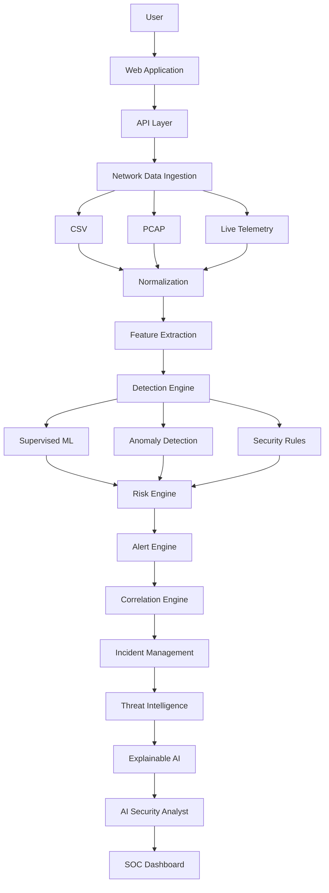

# AI-Based Network Intrusion Detection & Security Operations Platform

An AI-powered, web-based platform for network intrusion detection, security monitoring, threat analysis, and AI-assisted security investigation.

> **Status: Early development.** This repository currently implements the foundational MVP described below. The broader platform vision in this document describes long-term direction — most of it is **not yet built**. Every capability is explicitly labeled ✅ Implemented, 🚧 In Development, or 📋 Planned.

---

## Table of Contents

1. [Project Overview](#1-project-overview)
2. [Problem Statement](#2-problem-statement)
3. [Project Vision](#3-project-vision)
4. [Current Project Status](#4-current-project-status)
5. [MVP Capabilities](#5-mvp-capabilities)
6. [Long-Term Capabilities](#6-long-term-capabilities)
7. [Architecture](#7-architecture)
8. [Technology Stack](#8-technology-stack)
9. [ML Pipeline](#9-ml-pipeline)
10. [Security Operations Workflow](#10-security-operations-workflow)
11. [Explainable AI](#11-explainable-ai)
12. [Planned LLM Security Analyst](#12-planned-llm-security-analyst)
13. [Security Considerations](#13-security-considerations)
14. [Project Structure](#14-project-structure)
15. [Development Roadmap](#15-development-roadmap)
16. [Getting Started](#16-getting-started)
17. [Dataset / Research Methodology](#17-dataset--research-methodology)
18. [Evaluation Methodology](#18-evaluation-methodology)
19. [Limitations](#19-limitations)
20. [Future Work](#20-future-work)
21. [Authorized-Use Disclaimer](#21-authorized-use-disclaimer)
22. [License](#22-license)
23. [Project Attribution](#23-project-attribution)

---

## 1. Project Overview

This project aims to build an AI-assisted platform for detecting and investigating network intrusions — starting from a focused MVP that classifies uploaded network-flow data with a machine learning model, and growing toward a fuller security operations platform with correlation, incident management, threat intelligence, and AI-assisted investigation.

The repository is being developed incrementally, in small, reviewable steps. Nothing in this document should be read as a claim that the full platform already exists.

## 2. Problem Statement

Detecting malicious or anomalous network activity typically requires specialized commercial IDS/IPS platforms, dedicated SOC tooling, or significant manual analyst effort. Smaller teams, students, and researchers often lack access to an approachable, inspectable system for experimenting with ML-based intrusion detection and understanding how a detection pipeline is actually built — from raw flow data to a reviewable security finding.

## 3. Project Vision

The long-term vision is a platform that goes beyond a single classifier: it ingests network data from multiple sources, runs it through a detection engine combining supervised ML, anomaly detection, and rules, scores and correlates findings into alerts and incidents, enriches them with threat intelligence, and — eventually — assists a human analyst with AI-generated, evidence-grounded explanations and reports.

The MVP described in this repository is the **first implementation slice** of that vision, not the end state.

## 4. Current Project Status

| Area | Status |
|---|---|
| Project scope & documentation | ✅ Implemented |
| Git/GitHub project setup | ✅ Implemented |
| React frontend application | 📋 Planned |
| CSV upload UI | 📋 Planned |
| FastAPI backend | 📋 Planned |
| Data validation & preprocessing | 📋 Planned |
| Trained ML detection model | 📋 Planned |
| SQLite storage | 📋 Planned |
| Security dashboard | 📋 Planned |

The project is at the documentation/setup stage. Application code, the ML model, and the dataset have not yet been added.

## 5. MVP Capabilities

The MVP is the first implementation slice of the platform. Its intended workflow:

```
User
 ↓
React Web Application
 ↓
CSV Upload
 ↓
FastAPI Backend
 ↓
Validation
 ↓
Preprocessing
 ↓
ML Detection
 ↓
Confidence
 ↓
Severity
 ↓
SQLite
 ↓
Security Dashboard
```

Planned MVP feature set:

| Feature | Status |
|---|---|
| Web interface | 📋 Planned |
| CSV network-flow upload | 📋 Planned |
| Data validation | 📋 Planned |
| Data preprocessing | 📋 Planned |
| ML-based intrusion detection | 📋 Planned |
| Attack classification | 📋 Planned |
| Prediction confidence | 📋 Planned |
| Detection severity | 📋 Planned |
| Detection result storage | 📋 Planned |
| Detection history | 📋 Planned |
| Security dashboard | 📋 Planned |
| Search / filtering | 📋 Planned |
| Analytics | 📋 Planned |
| Model performance metrics | 📋 Planned |

None of these are implemented yet. This table will be updated as each capability is actually built.

## 6. Long-Term Capabilities

The platform's long-term scope spans several capability areas. All are currently 📋 Planned unless noted otherwise.

**Detection**
- Supervised ML intrusion detection — 📋 Planned
- Multiclass attack classification — 📋 Planned
- Anomaly detection — 📋 Planned
- Rule-based detection — 📋 Planned
- Hybrid detection (ML + rules + anomaly) — 📋 Planned

**Network visibility**
- CSV / network-flow ingestion — 📋 Planned
- PCAP ingestion — 📋 Planned
- Authorized live network telemetry — 📋 Planned

**Security operations**
- Risk scoring — 📋 Planned
- Alert management — 📋 Planned
- Event correlation — 📋 Planned
- Incident management — 📋 Planned
- Incident timelines — 📋 Planned
- Asset inventory — 📋 Planned

**Threat intelligence**
- Indicator extraction — 📋 Planned
- Threat-intelligence enrichment — 📋 Planned

**AI**
- Explainable AI — 📋 Planned
- LLM Security Analyst — 📋 Planned
- Evidence-grounded investigation — 📋 Planned
- AI-assisted reporting — 📋 Planned

**Platform**
- Web dashboard — 📋 Planned
- Authentication — 📋 Planned
- RBAC — 📋 Planned
- Audit logging — 📋 Planned
- Observability — 📋 Planned
- Docker / deployment — 📋 Planned

## 7. Architecture

The diagram below describes the **target architecture** for the full platform. It is a long-term design reference, not a description of what currently exists. Components will be implemented incrementally, stage by stage (see [Development Roadmap](#15-development-roadmap)); most of this diagram is 📋 Planned today.



The current MVP implements only the first slice of this pipeline: ingestion (CSV), a basic detection engine (supervised ML), and a simple dashboard — without risk scoring, correlation, incidents, threat intelligence, or AI-assisted analysis.

## 8. Technology Stack

| Layer | Technology | Status |
|---|---|---|
| Frontend | React, TypeScript, Tailwind CSS | 📋 Planned (MVP stack) |
| Backend | Python, FastAPI | 📋 Planned (MVP stack) |
| Machine Learning | Pandas, NumPy, scikit-learn, Joblib | 📋 Planned (MVP stack) |
| Database (MVP) | SQLite | 📋 Planned |
| Database (later versions) | PostgreSQL | 📋 Planned |
| Infrastructure (future, if needed) | Docker | 📋 Planned |
| Infrastructure (future, if scale requires) | Redis / Kafka | 📋 Planned |
| CI/CD | — | 📋 Planned |

Technology choices are driven by actual MVP requirements. Infrastructure such as Redis, Kafka, or container orchestration will only be introduced if and when scale or operational needs justify it — not added speculatively.

## 9. ML Pipeline

Planned ML pipeline for the detection model:

```
Dataset
 ↓
Exploration
 ↓
Cleaning
 ↓
Feature Engineering
 ↓
Preprocessing
 ↓
Train/Test Split
 ↓
Model Training
 ↓
Evaluation
 ↓
Model Artifact
 ↓
Inference
 ↓
Monitoring
```

Evaluation will be based on standard classification metrics, including:

- Precision
- Recall
- F1-score
- Confusion matrix
- Class-specific performance (per attack category)

**No model has been trained or evaluated yet.** No numerical performance results exist in this repository. Any metrics reported in the future will reflect actual evaluation on a specific dataset and will be documented alongside the dataset, methodology, and known limitations.

## 10. Security Operations Workflow

Beyond simple ML classification, the long-term platform aims to support a full security-operations workflow:

```
Network Event
 ↓
Detection
 ↓
Context
 ↓
Risk
 ↓
Alert
 ↓
Correlation
 ↓
Incident
 ↓
Investigation
 ↓
Resolution
```

This workflow is 📋 Planned in its entirety. The current MVP only addresses the "Detection" step (classifying uploaded flow records) — it does not yet add context, compute risk, raise alerts, correlate events, or manage incidents.

## 11. Explainable AI

📋 **Planned.** As detection capability matures, the platform intends to provide explanations for individual predictions (e.g., which features drove a classification, confidence rationale) so that detections are reviewable rather than opaque. No explainability components exist yet.

## 12. Planned LLM Security Analyst

📋 **Planned — future capability.** An LLM-based security analyst assistant is envisioned to eventually help with:

- Incident summaries
- Detection explanations
- Event timelines
- Investigation assistance
- Threat-intelligence summaries
- Security reports

Any such assistant will be designed to ground its responses in actual, retrieved security evidence from the platform's own data (detections, alerts, incidents, telemetry) — not to invent events, findings, or conclusions that are not supported by that evidence. This component does not exist yet and is not part of the current MVP.

## 13. Security Considerations

- This project is intended for **authorized** security research, learning, and defensive use only (see [Authorized-Use Disclaimer](#21-authorized-use-disclaimer)).
- No live network capture or packet inspection capability exists yet; current/near-term scope is limited to offline CSV/flow data uploaded by the user.
- As authentication, RBAC, and audit logging are 📋 Planned and not yet implemented, the MVP is **not** suitable for deployment on shared or production infrastructure, or for handling sensitive real-world traffic, until those controls exist.
- Any future LLM-assisted analysis will need its own security review (prompt injection, data leakage, evidence grounding) before being treated as trustworthy input to a security decision.

## 14. Project Structure

The repository currently contains only documentation. Application structure will be added and documented here as it is implemented.

```
Intrusion-Detection-System/
├── README.md         # This file
├── MVP_SCOPE.md       # MVP scope definition
└── (application code, ML pipeline, and tests to be added)
```

## 15. Development Roadmap

### Stage 1 — MVP
Web application, CSV ingestion, ML detection, database, dashboard, analytics

### Stage 2 — Network Visibility
PCAP ingestion, network-flow processing, improved feature extraction

### Stage 3 — Advanced Detection
Anomaly detection, hybrid detection, risk scoring

### Stage 4 — Security Operations
Alerts, event correlation, incidents, asset inventory

### Stage 5 — Threat Intelligence
Indicator extraction, threat-intelligence enrichment

### Stage 6 — Explainable AI
Model explanations, detection context

### Stage 7 — AI Security Analyst
Evidence retrieval, LLM-assisted investigation, incident summaries, report generation

### Stage 8 — Production Engineering
Authentication, RBAC, audit logging, observability, testing, Docker, deployment, performance optimization

All stages above are roadmap items. **Stage 1 is in progress; Stages 2–8 have not been started.**

## 16. Getting Started

The application does not exist yet — there is nothing to run. This section will be filled in with setup and run instructions once the MVP backend, frontend, and ML pipeline are implemented.

## 17. Dataset / Research Methodology

No dataset has been selected or added to this repository yet. When a dataset is chosen, this section will document: the dataset's source and license, its intended use (training/evaluation), known biases or limitations, and how it maps to the platform's detection and classification categories.

## 18. Evaluation Methodology

No model has been evaluated yet. When evaluation is performed, this section will document the train/test (and/or cross-validation) methodology, the metrics used (precision, recall, F1-score, confusion matrix, per-class performance), and the actual results — with no fabricated or assumed numbers.

## 19. Limitations

Honest, current limitations of this project:

- **No application exists yet** — the MVP described in this document is not yet implemented.
- **Dataset limitations:** once a dataset is chosen, any model trained on it will be bounded by that dataset's coverage, age, and label quality — it will not generalize perfectly to arbitrary real-world traffic.
- **False positives / false negatives:** any ML-based detector will misclassify some traffic; results will require human review, especially early on.
- **Offline datasets vs. real network traffic:** training on static, offline flow datasets does not guarantee equivalent performance on live network traffic, which this MVP does not yet support.
- **ML generalization:** models may overfit to the characteristics of their training data/environment.
- **Need for human validation:** detections should be treated as decision support, not as automated ground truth, particularly in this project's early stages.
- **MVP limitations:** the MVP intentionally excludes live capture, PCAP processing, correlation, incident management, threat intelligence, and AI-assisted analysis — it is a narrow first slice.
- **Future live-monitoring complexity:** moving from offline CSV analysis to live telemetry introduces substantial additional engineering and security considerations not yet addressed.
- **LLM reliability and security:** any future LLM-based analyst feature carries risks of hallucination, prompt injection, and overconfidence, and will require dedicated safeguards before being trusted for security decisions.

## 20. Future Work

See [Development Roadmap](#15-development-roadmap) and [Long-Term Capabilities](#6-long-term-capabilities) above for the full set of planned future work across detection, network visibility, security operations, threat intelligence, AI, and platform engineering.

## 21. Authorized-Use Disclaimer

This project is intended for **authorized security research, education, and defensive purposes only**. It must only be used on networks, systems, or data that you own or are explicitly authorized to test or analyze. Do not use this project, or any derivative of it, to attack, scan, monitor, or analyze networks or systems without proper authorization. The authors and contributors assume no liability for misuse.

## 22. License

License to be determined. *(Placeholder — a license file will be added in a future step.)*

## 23. Project Attribution

Maintained by Prasoon Kashyap. Developed incrementally with AI pair-programming assistance (Claude Code). Contribution guidelines will be added as the project matures.
